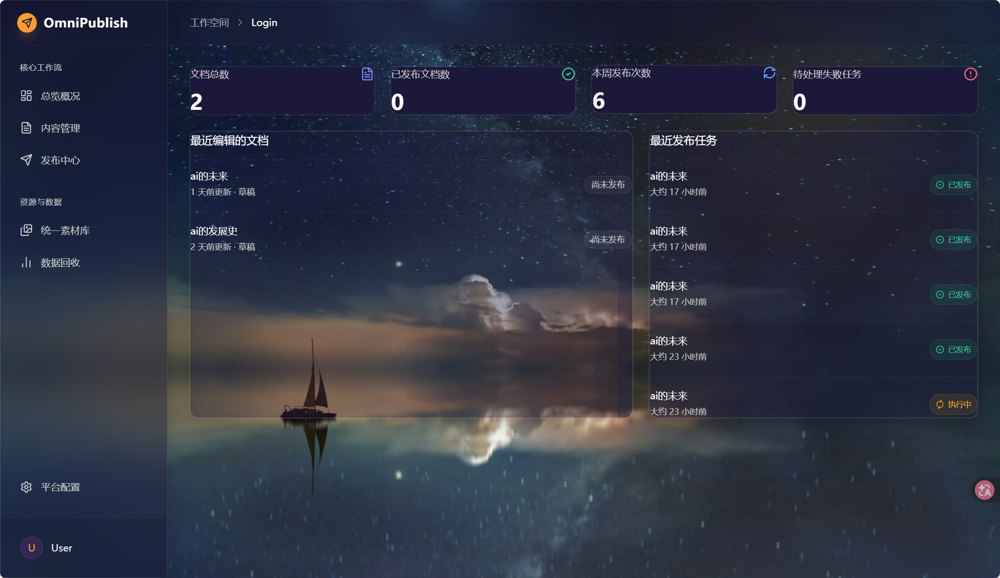

# OmniPublish

OmniPublish 是一个自托管的多平台内容工作台，用于管理 Markdown 文档、素材、平台版本和发布任务。项目采用 pnpm Monorepo，包含 Next.js 管理界面、BullMQ Worker、平台适配器、AI 内容辅助模块和数据统计页面。



> 当前版本适合本地开发和技术演示。第三方平台页面、接口及风控规则可能随时变化；使用平台适配器前，请确认账号权限并遵守对应平台的服务条款。首次部署前请阅读下方的安全说明。

## 主要功能

- Markdown 文档编辑、预览、版本快照和素材管理。
- 微信公众号与博客园 API 适配器。
- 掘金、知乎、CSDN 和小红书 Playwright 适配器。
- BullMQ 发布队列、任务状态和定时数据回收。
- DeepSeek 文本生成与 MiniMax 图片生成接口。
- PostgreSQL 数据模型、MinIO 素材存储和 Recharts 数据看板。
- 可选的 Chrome 扩展，用于辅助掘金页面发布。

平台自动化依赖页面 DOM 和账号能力。建议先保存草稿并人工检查，再执行公开发布。

## 技术栈

| 模块 | 技术 |
| --- | --- |
| Web | Next.js 14、React 18、NextAuth、Tailwind CSS |
| Worker | Node.js、BullMQ、Playwright |
| 数据库 | PostgreSQL、Prisma |
| 队列 | Redis |
| 对象存储 | MinIO / S3 API |
| 内容处理 | unified、remark、rehype |
| AI | DeepSeek、MiniMax |
| 测试 | Vitest |

## 项目结构

```text
apps/
  web/                 Next.js 管理界面和 Server Actions
  worker/              发布任务及指标回收 Worker
  browser-extension/   可选 Chrome 扩展
packages/
  ai-provider/         AI 客户端与生成任务
  card-renderer/       图文卡片布局计算
  content-core/        Markdown AST 处理
  db/                  Prisma Schema、数据库与加密工具
  platform-sdk/        各平台发布适配器
  queue/               BullMQ 队列定义
scripts/               本地开发和基础设施检查脚本
tests/fixtures/        测试文档
docs/images/           README 界面截图
```

## 本地运行

### 1. 环境要求

- Node.js 20 或更新版本
- pnpm 11
- Docker 与 Docker Compose

安装依赖并创建本地配置：

```bash
corepack enable
pnpm install --frozen-lockfile
cp .env.example .env
```

生成两个必须的安全密钥，并填入 `.env`：

```bash
openssl rand -base64 32  # AUTH_SECRET
openssl rand -hex 32     # CREDENTIAL_ENCRYPTION_KEY
```

`CREDENTIAL_ENCRYPTION_KEY` 必须是 64 个十六进制字符。更换该密钥后，已经保存的平台凭据将无法解密。

### 2. 启动基础设施

```bash
docker compose up -d
pnpm --filter @omnipublish/db exec prisma generate
pnpm --filter @omnipublish/db exec prisma db push
```

Docker Compose 会启动：

- PostgreSQL：`localhost:5432`
- Redis：`localhost:6379`
- MinIO API：`localhost:9000`
- MinIO 控制台：`localhost:9002`

Compose 文件中的数据库和 MinIO 凭据仅用于本机开发。部署到共享环境前必须修改。

### 3. 启动应用

```bash
# 同时启动 Web 与 Worker
pnpm dev

# 或分别启动
pnpm --filter web dev
pnpm --filter @omnipublish/worker dev
```

访问 `http://localhost:8080`，通过注册页面创建本地账号。需要使用浏览器平台适配器时，再安装 Chromium：

```bash
pnpm --filter @omnipublish/worker exec playwright install chromium
```

## 环境变量

完整模板见 [.env.example](.env.example)。常用配置如下：

| 变量 | 用途 |
| --- | --- |
| `DATABASE_URL` | PostgreSQL 连接地址 |
| `REDIS_URL` | Redis 连接地址 |
| `AUTH_SECRET` | NextAuth 会话签名密钥 |
| `CREDENTIAL_ENCRYPTION_KEY` | 平台凭据 AES-256-GCM 加密密钥 |
| `S3_*` | MinIO 或兼容 S3 的对象存储配置 |
| `DEEPSEEK_*` | 文本生成服务配置 |
| `MINIMAX_*` | 图片生成服务配置 |
| `WECHAT_*` | 微信公众号 API 配置 |
| `CNBLOGS_*` | 博客园 MetaWeblog 配置 |

不要提交 `.env`、Cookie、平台访问令牌、API 密钥、数据库导出或 Playwright 调试文件。

## 测试与类型检查

```bash
pnpm typecheck
pnpm test
```

测试覆盖 Markdown AST、AI 任务、数据库安全工具、队列和平台适配器契约。真实平台发布需要有效账号和外部网络，不属于默认单元测试范围。

## 安全说明

- 用户密码使用带随机盐的 `scrypt` 哈希保存。
- 平台 Cookie、AppSecret 和访问令牌使用 AES-256-GCM 加密后写入数据库。
- 项目不提供默认管理员账号或固定认证密钥。
- 界面截图不包含真实账号、Cookie 或 API 密钥。
- 浏览器自动化会接触账号会话，仅应在受信任的本机或隔离环境中运行。
- 生产部署还需要 HTTPS、限流、CSRF/审计策略、密钥轮换和更严格的权限审查。

项目暂未附带开源许可证。代码可公开查看，但复制、修改和再分发权限需由代码权利人另行明确。
